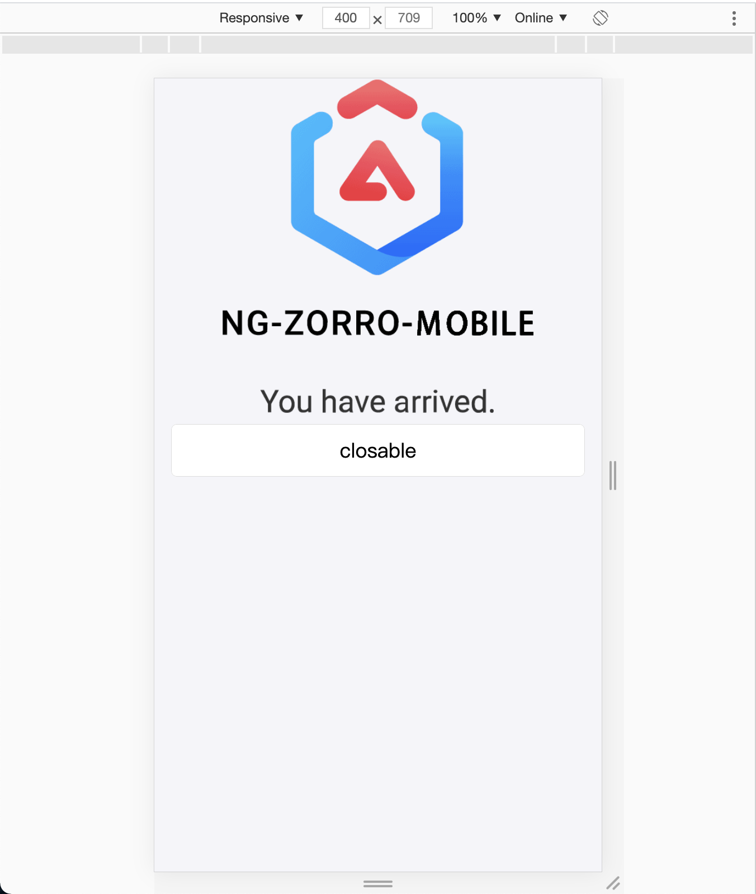
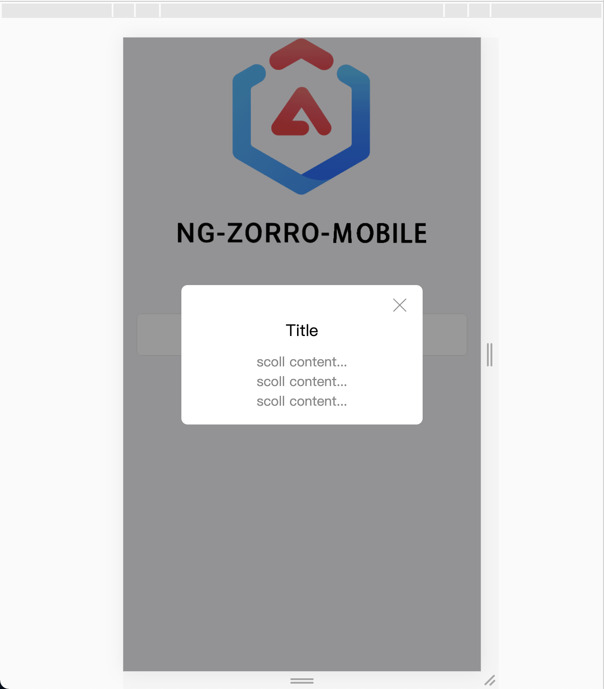

# csv转对象
csv读取考验基本算法。

根据理解，难点在于给出的interface中存在parent和children这两个互相嵌套的结构。

最终结果没能完全满足要求。

# find函数
难点在于通过函数的形式返回一个含有函数属性的对象。
```
var find = funciton(obj){
    return {
        a:a
        b:b
        c:function(d){
            ...
        }
    }
}
```
从而让可以直接调用find.c
如果将find制作成一个对象构造器，就不符合题意。

最终结果符合要求


# AngularPopComponent
本弹窗采用了ng zorro mobile框架
http://ng.mobile.ant.design/#/docs/introduce/zh

使用了里面提供的modal组件
http://ng.mobile.ant.design/#/components/modal/zh

最终效果

1.按钮按下前

2.按钮按下后


# XHR缓存
目前接触项目采用angular的akita来实现异步操作

通过

未接触ajax开发，并且相关内容无法在短时间掌握。故而放弃该题。

